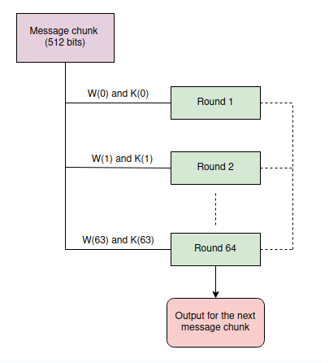
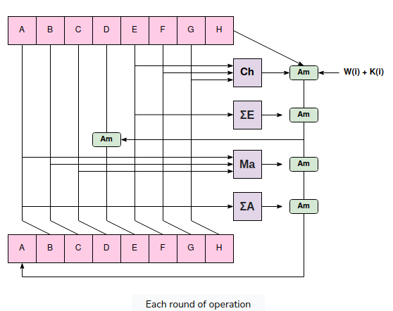
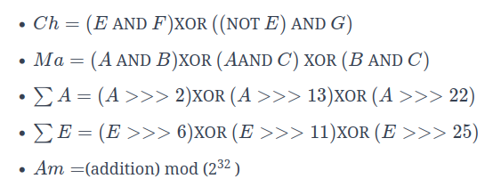

# SHA-256

## Overview
This is a hardware implementation of the SHA-256 cryptographic hashing algorithm. The hardware receives messages of any length (separated into chunks of 512 bits) and generates a 256-bit hash.
A CPU handles the pre-processing stage, where the message is converted into 512-bit chunks. Then, our hardware computes the hash in 114 clock cycles. 
## Algorithm
SHA-256 is in the SHA-2 family of cryptographic hash functions and has not been cracked as of May 2024. The hashing algorithm ideally produces a unique hash for any input, which is useful for verifying the integrity of important data like passwords. 

SHA-256 first creates a message schedule array of 32 x 64 bits based on a 512-bit chunk of input. Then, the data undergoes 64 rounds of processing to create a secure hash where the original message cannot be determined from the final hash.



W: message schedule array → (64x32)
K: constants → (64x32)





## Implementation
Our state machine consists of 5 states. We start out with an IDLE state, where the hardware is ready to receive new data. 

Once it receives a 512-bit chunk of data in the `input_valid` flag is set high, the hardware enters the START_CHUNK state, where an empty message schedule array is created and the `index` variable is set to prepare for filling the message schedule array. 

Then, the hardware enters the COMPUTE_MSA state, where the 32 x 64 message schedule array is computed based on the 512-bit input. The first 16 blocks of 32 bits contain the 512-bit input, and the other 48 blocks are computed based on this input. 

Next, the hardware enters the COMPRESSION_FUNC state, where eight hashing variables are computed and updated in 64 rounds of processing. 

Finally,  we enter the OUTPUT_VALID state, where all the hashing variables are merged together and sent as an output. If there are multiple chunks of data for an input message, the state will go back to the START_CHUNK state and loop through this algorithm again to create an updated hash of 256 bits.

## Testing
For testing we used cocotb software to unit test edge cases. Through these simulations we were successfully passes all our unit tests. The python module we are using is taken from the github repository: [repo](https://github.com/pdoms/SHA256-PYTHON) and [blog about the python code](https://medium.com/@domspaulo/python-implementation-of-sha-256-from-scratch-924f660c5d57). 

During our implementation of the SHA-256 we found these websites to be useful for understanding the algorithm: [Step by step walk through](https://www.educative.io/answers/what-are-the-different-steps-in-sha-256) and [Pseudocode section](https://en.wikipedia.org/wiki/SHA-2).
To run the unit tests, you must have the OSS CAD Suite and cocotb installed. 

Run ```setup_cafe```

[OSS CAD Suite](https://www.opensourceagenda.com/projects/oss-cad-suite-build#Installation) - open source tools for digital design and verification
[Cocotb Official Docs](https://docs.cocotb.org/en/stable/quickstart.html)- good place to get started if you are already familiar with python and coroutines.
[cocotb-test](hhttps://github.com/themperek/cocotb-test)- a wrapper for cocotb that makes things more useful.

Our make file will take care of calling the files. **From the `cocotb` directory in the repo, run
`$make` in the terminal to run the test.**

